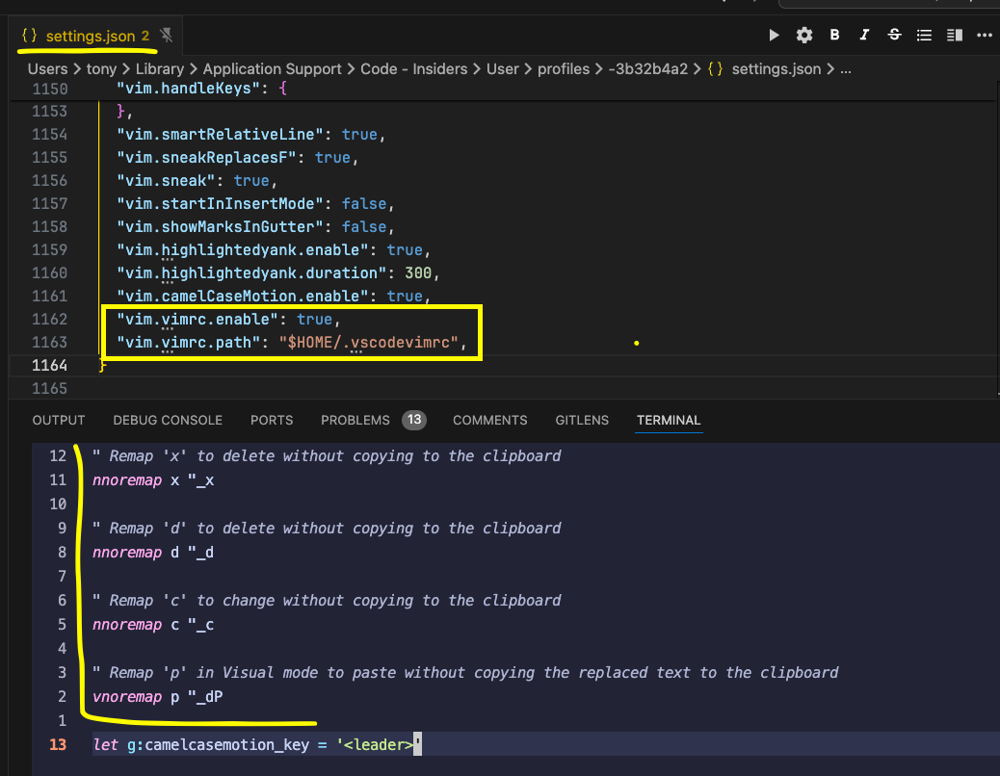

# vim/neovim configuration

## Configuration to avoid add the deleted, replaced and selected code in the clipboard

- VS code



- Add the following configuration

```vim
" Remap 'x' to delete without copying to the clipboard
nnoremap x "_x

" Remap 'd' to delete without copying to the clipboard
nnoremap d "_d

" Remap 'c' to change without copying to the clipboard
nnoremap c "_c

" Remap 'p' in Visual mode to paste without copying the replaced text to the clipboard
vnoremap p "_dP
```

to the following files:

- ~/.vimrc (vim),
- ~/.ideavimrc (IntelliJ IDEA),
- ~/.vscodevimrc (VS Code)

- for the neovim configuration, add the configuration:

```lua
-- Shorten function name
local keymap = vim.keymap.set

-- Remap 'x' to delete without copying to the clipboard
keymap("n", "x", '"_x', { noremap = true, silent = true })

-- Remap 'd' to delete without copying to the clipboard
keymap("n", "d", '"_d', { noremap = true, silent = true })

-- Optionally, remap 'c' to change without copying to the clipboard
keymap("n", "c", '"_c', { noremap = true, silent = true })

-- Remap 'p' in Visual mode to paste without copying the replaced text to the clipboard
keymap("v", "p", '"_dP', { noremap = true, silent = true })
```

to the file `~/.config/nvim/lua/config/keymaps.lua`

## Vim configuration for VS code:

```json
  // ----------------- VIM -----------------
  "vim.easymotion": true,
  "vim.incsearch": true,
  "vim.useSystemClipboard": true,
  "vim.useCtrlKeys": true,
  // "vim.hlsearch": true,
  "vim.insertModeKeyBindings": [
    {
      "before": [
        "j",
        "j"
      ],
      "after": [
        "<Esc>"
      ]
    }
  ],
  "vim.normalModeKeyBindingsNonRecursive": [
    {
      "before": [
        "<leader>",
        "d"
      ],
      "after": [
        "d",
        "d"
      ]
    },
    {
      "before": [
        "<C-n>"
      ],
      "commands": [
        ":nohl"
      ]
    },
    {
      "before": [
        "K"
      ],
      "commands": [
        "lineBreakInsert"
      ],
      "silent": true
    }
  ],
  "vim.leader": "<space>",
  "vim.handleKeys": {
    "<C-a>": false,
    "<C-f>": false
  },
  "vim.smartRelativeLine": true,
  "vim.sneakReplacesF": true,
  "vim.sneak": true,
  "vim.startInInsertMode": false,
  "vim.showMarksInGutter": false,
  "vim.highlightedyank.enable": true,
  "vim.highlightedyank.duration": 300,
  "vim.camelCaseMotion.enable": true,
  "vim.vimrc.enable": true,
  "vim.vimrc.path": "$HOME/.vscodevimrc",
```
